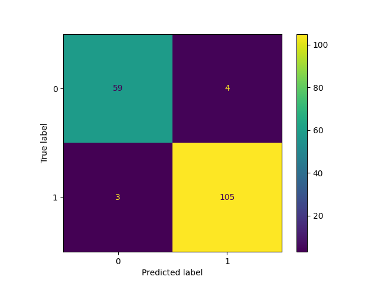

# Model description

This is a `HistGradientBoostingClassifier` model trained on breast cancer dataset. It's trained with `HalvingGridSearchCV`, with parameter grids on `max_leaf_nodes` and `max_depth`.

## Intended uses & limitations

This model is not ready to be used in production.

## Training Procedure

### Hyperparameters

The model is trained with below hyperparameters.

<details>
<summary> Click to expand </summary>

| Hyperparameter                  | Value                                                    |
|---------------------------------|----------------------------------------------------------|
| aggressive_elimination          | False                                                    |
| cv                              | 5                                                        |
| error_score                     | nan                                                      |
| estimator__categorical_features |                                                          |
| estimator__class_weight         |                                                          |
| estimator__early_stopping       | auto                                                     |
| estimator__interaction_cst      |                                                          |
| estimator__l2_regularization    | 0.0                                                      |
| estimator__learning_rate        | 0.1                                                      |
| estimator__loss                 | log_loss                                                 |
| estimator__max_bins             | 255                                                      |
| estimator__max_depth            |                                                          |
| estimator__max_iter             | 100                                                      |
| estimator__max_leaf_nodes       | 31                                                       |
| estimator__min_samples_leaf     | 20                                                       |
| estimator__monotonic_cst        |                                                          |
| estimator__n_iter_no_change     | 10                                                       |
| estimator__random_state         |                                                          |
| estimator__scoring              | loss                                                     |
| estimator__tol                  | 1e-07                                                    |
| estimator__validation_fraction  | 0.1                                                      |
| estimator__verbose              | 0                                                        |
| estimator__warm_start           | False                                                    |
| estimator                       | HistGradientBoostingClassifier()                         |
| factor                          | 3                                                        |
| max_resources                   | auto                                                     |
| min_resources                   | exhaust                                                  |
| n_jobs                          | -1                                                       |
| param_grid                      | {'max_leaf_nodes': [5, 10, 15], 'max_depth': [2, 5, 10]} |
| random_state                    | 42                                                       |
| refit                           | True                                                     |
| resource                        | n_samples                                                |
| return_train_score              | True                                                     |
| scoring                         |                                                          |
| verbose                         | 0                                                        |

</details>

### Model Plot

The model plot is below.

<style>#sk-container-id-2 {color: black;background-color: white;}#sk-container-id-2 pre{padding: 0;}#sk-container-id-2 div.sk-toggleable {background-color: white;}#sk-container-id-2 label.sk-toggleable__label {cursor: pointer;display: block;width: 100%;margin-bottom: 0;padding: 0.3em;box-sizing: border-box;text-align: center;}#sk-container-id-2 label.sk-toggleable__label-arrow:before {content: "▸";float: left;margin-right: 0.25em;color: #696969;}#sk-container-id-2 label.sk-toggleable__label-arrow:hover:before {color: black;}#sk-container-id-2 div.sk-estimator:hover label.sk-toggleable__label-arrow:before {color: black;}#sk-container-id-2 div.sk-toggleable__content {max-height: 0;max-width: 0;overflow: hidden;text-align: left;background-color: #f0f8ff;}#sk-container-id-2 div.sk-toggleable__content pre {margin: 0.2em;color: black;border-radius: 0.25em;background-color: #f0f8ff;}#sk-container-id-2 input.sk-toggleable__control:checked~div.sk-toggleable__content {max-height: 200px;max-width: 100%;overflow: auto;}#sk-container-id-2 input.sk-toggleable__control:checked~label.sk-toggleable__label-arrow:before {content: "▾";}#sk-container-id-2 div.sk-estimator input.sk-toggleable__control:checked~label.sk-toggleable__label {background-color: #d4ebff;}#sk-container-id-2 div.sk-label input.sk-toggleable__control:checked~label.sk-toggleable__label {background-color: #d4ebff;}#sk-container-id-2 input.sk-hidden--visually {border: 0;clip: rect(1px 1px 1px 1px);clip: rect(1px, 1px, 1px, 1px);height: 1px;margin: -1px;overflow: hidden;padding: 0;position: absolute;width: 1px;}#sk-container-id-2 div.sk-estimator {font-family: monospace;background-color: #f0f8ff;border: 1px dotted black;border-radius: 0.25em;box-sizing: border-box;margin-bottom: 0.5em;}#sk-container-id-2 div.sk-estimator:hover {background-color: #d4ebff;}#sk-container-id-2 div.sk-parallel-item::after {content: "";width: 100%;border-bottom: 1px solid gray;flex-grow: 1;}#sk-container-id-2 div.sk-label:hover label.sk-toggleable__label {background-color: #d4ebff;}#sk-container-id-2 div.sk-serial::before {content: "";position: absolute;border-left: 1px solid gray;box-sizing: border-box;top: 0;bottom: 0;left: 50%;z-index: 0;}#sk-container-id-2 div.sk-serial {display: flex;flex-direction: column;align-items: center;background-color: white;padding-right: 0.2em;padding-left: 0.2em;position: relative;}#sk-container-id-2 div.sk-item {position: relative;z-index: 1;}#sk-container-id-2 div.sk-parallel {display: flex;align-items: stretch;justify-content: center;background-color: white;position: relative;}#sk-container-id-2 div.sk-item::before, #sk-container-id-2 div.sk-parallel-item::before {content: "";position: absolute;border-left: 1px solid gray;box-sizing: border-box;top: 0;bottom: 0;left: 50%;z-index: -1;}#sk-container-id-2 div.sk-parallel-item {display: flex;flex-direction: column;z-index: 1;position: relative;background-color: white;}#sk-container-id-2 div.sk-parallel-item:first-child::after {align-self: flex-end;width: 50%;}#sk-container-id-2 div.sk-parallel-item:last-child::after {align-self: flex-start;width: 50%;}#sk-container-id-2 div.sk-parallel-item:only-child::after {width: 0;}#sk-container-id-2 div.sk-dashed-wrapped {border: 1px dashed gray;margin: 0 0.4em 0.5em 0.4em;box-sizing: border-box;padding-bottom: 0.4em;background-color: white;}#sk-container-id-2 div.sk-label label {font-family: monospace;font-weight: bold;display: inline-block;line-height: 1.2em;}#sk-container-id-2 div.sk-label-container {text-align: center;}#sk-container-id-2 div.sk-container {/* jupyter's `normalize.less` sets `[hidden] { display: none; }` but bootstrap.min.css set `[hidden] { display: none !important; }` so we also need the `!important` here to be able to override the default hidden behavior on the sphinx rendered scikit-learn.org. See: https://github.com/scikit-learn/scikit-learn/issues/21755 */display: inline-block !important;position: relative;}#sk-container-id-2 div.sk-text-repr-fallback {display: none;}</style><div id="sk-container-id-2" class="sk-top-container" style="overflow: auto;"><div class="sk-text-repr-fallback"><pre>HalvingGridSearchCV(estimator=HistGradientBoostingClassifier(), n_jobs=-1,param_grid={&#x27;max_depth&#x27;: [2, 5, 10],&#x27;max_leaf_nodes&#x27;: [5, 10, 15]},random_state=42)</pre><b>In a Jupyter environment, please rerun this cell to show the HTML representation or trust the notebook. <br />On GitHub, the HTML representation is unable to render, please try loading this page with nbviewer.org.</b></div><div class="sk-container" hidden><div class="sk-item sk-dashed-wrapped"><div class="sk-label-container"><div class="sk-label sk-toggleable"><input class="sk-toggleable__control sk-hidden--visually" id="sk-estimator-id-4" type="checkbox" ><label for="sk-estimator-id-4" class="sk-toggleable__label sk-toggleable__label-arrow">HalvingGridSearchCV</label><div class="sk-toggleable__content"><pre>HalvingGridSearchCV(estimator=HistGradientBoostingClassifier(), n_jobs=-1,param_grid={&#x27;max_depth&#x27;: [2, 5, 10],&#x27;max_leaf_nodes&#x27;: [5, 10, 15]},random_state=42)</pre></div></div></div><div class="sk-parallel"><div class="sk-parallel-item"><div class="sk-item"><div class="sk-label-container"><div class="sk-label sk-toggleable"><input class="sk-toggleable__control sk-hidden--visually" id="sk-estimator-id-5" type="checkbox" ><label for="sk-estimator-id-5" class="sk-toggleable__label sk-toggleable__label-arrow">estimator: HistGradientBoostingClassifier</label><div class="sk-toggleable__content"><pre>HistGradientBoostingClassifier()</pre></div></div></div><div class="sk-serial"><div class="sk-item"><div class="sk-estimator sk-toggleable"><input class="sk-toggleable__control sk-hidden--visually" id="sk-estimator-id-6" type="checkbox" ><label for="sk-estimator-id-6" class="sk-toggleable__label sk-toggleable__label-arrow">HistGradientBoostingClassifier</label><div class="sk-toggleable__content"><pre>HistGradientBoostingClassifier()</pre></div></div></div></div></div></div></div></div></div></div>

## Evaluation Results

You can find the details about evaluation process and the evaluation results.

| Metric   |    Value |
|----------|----------|
| accuracy | 0.959064 |
| f1 score | 0.959064 |

### Confusion Matrix



### Hyperparameter search results

<details>
<summary> Click to expand </summary>

|   iter |   n_resources |   mean_fit_time |   std_fit_time |   mean_score_time |   std_score_time |   param_max_depth |   param_max_leaf_nodes | params                                  |   split0_test_score |   split1_test_score |   split2_test_score |   split3_test_score |   split4_test_score |   mean_test_score |   std_test_score |   rank_test_score |   split0_train_score |   split1_train_score |   split2_train_score |   split3_train_score |   split4_train_score |   mean_train_score |   std_train_score |
|--------|---------------|-----------------|----------------|-------------------|------------------|-------------------|------------------------|-----------------------------------------|---------------------|---------------------|---------------------|---------------------|---------------------|-------------------|------------------|-------------------|----------------------|----------------------|----------------------|----------------------|----------------------|--------------------|-------------------|
|      0 |            44 |       0.0364673 |     0.00137727 |        0.00467963 |      0.000437588 |                 2 |                      5 | {'max_depth': 2, 'max_leaf_nodes': 5}   |            0.875    |            0.5      |            0.625    |            0.75     |            0.375    |          0.625    |        0.176777  |                 5 |             0.628571 |             0.628571 |             0.628571 |             0.514286 |             0.514286 |           0.582857 |         0.0559883 |
|      0 |            44 |       0.0416689 |     0.0053036  |        0.00610275 |      0.00121253  |                 2 |                     10 | {'max_depth': 2, 'max_leaf_nodes': 10}  |            0.875    |            0.5      |            0.625    |            0.75     |            0.375    |          0.625    |        0.176777  |                 5 |             0.628571 |             0.628571 |             0.628571 |             0.514286 |             0.514286 |           0.582857 |         0.0559883 |
|      0 |            44 |       0.0417622 |     0.00202692 |        0.00472674 |      0.000454188 |                 2 |                     15 | {'max_depth': 2, 'max_leaf_nodes': 15}  |            0.875    |            0.5      |            0.625    |            0.75     |            0.375    |          0.625    |        0.176777  |                 5 |             0.628571 |             0.628571 |             0.628571 |             0.514286 |             0.514286 |           0.582857 |         0.0559883 |
|      0 |            44 |       0.0287241 |     0.00502255 |        0.00473881 |      0.00103753  |                 5 |                      5 | {'max_depth': 5, 'max_leaf_nodes': 5}   |            0.875    |            0.5      |            0.625    |            0.75     |            0.375    |          0.625    |        0.176777  |                 5 |             0.628571 |             0.628571 |             0.628571 |             0.514286 |             0.514286 |           0.582857 |         0.0559883 |
|      0 |            44 |       0.027582  |     0.00297185 |        0.00384212 |      0.000206414 |                 5 |                     10 | {'max_depth': 5, 'max_leaf_nodes': 10}  |            0.875    |            0.5      |            0.625    |            0.75     |            0.375    |          0.625    |        0.176777  |                 5 |             0.628571 |             0.628571 |             0.628571 |             0.514286 |             0.514286 |           0.582857 |         0.0559883 |
|      0 |            44 |       0.0282766 |     0.00176699 |        0.0041244  |      0.000461875 |                 5 |                     15 | {'max_depth': 5, 'max_leaf_nodes': 15}  |            0.875    |            0.5      |            0.625    |            0.75     |            0.375    |          0.625    |        0.176777  |                 5 |             0.628571 |             0.628571 |             0.628571 |             0.514286 |             0.514286 |           0.582857 |         0.0559883 |
|      0 |            44 |       0.0276588 |     0.00172639 |        0.00428057 |      0.000614017 |                10 |                      5 | {'max_depth': 10, 'max_leaf_nodes': 5}  |            0.875    |            0.5      |            0.625    |            0.75     |            0.375    |          0.625    |        0.176777  |                 5 |             0.628571 |             0.628571 |             0.628571 |             0.514286 |             0.514286 |           0.582857 |         0.0559883 |
|      0 |            44 |       0.0279871 |     0.00233633 |        0.00380721 |      0.000342582 |                10 |                     10 | {'max_depth': 10, 'max_leaf_nodes': 10} |            0.875    |            0.5      |            0.625    |            0.75     |            0.375    |          0.625    |        0.176777  |                 5 |             0.628571 |             0.628571 |             0.628571 |             0.514286 |             0.514286 |           0.582857 |         0.0559883 |
|      0 |            44 |       0.018503  |     0.00201536 |        0.00275998 |      0.000491374 |                10 |                     15 | {'max_depth': 10, 'max_leaf_nodes': 15} |            0.875    |            0.5      |            0.625    |            0.75     |            0.375    |          0.625    |        0.176777  |                 5 |             0.628571 |             0.628571 |             0.628571 |             0.514286 |             0.514286 |           0.582857 |         0.0559883 |
|      1 |           132 |       0.0799966 |     0.00543181 |        0.00442705 |      0.00043712  |                10 |                      5 | {'max_depth': 10, 'max_leaf_nodes': 5}  |            0.961538 |            0.923077 |            0.923077 |            0.961538 |            0.961538 |          0.946154 |        0.0188422 |                 2 |             1        |             1        |             1        |             1        |             1        |           1        |         0         |
|      1 |           132 |       0.07821   |     0.00702791 |        0.00455184 |      0.00122804  |                10 |                     10 | {'max_depth': 10, 'max_leaf_nodes': 10} |            0.961538 |            0.923077 |            0.923077 |            0.961538 |            0.961538 |          0.946154 |        0.0188422 |                 2 |             1        |             1        |             1        |             1        |             1        |           1        |         0         |
|      1 |           132 |       0.0726778 |     0.00244798 |        0.00384359 |      0.0006801   |                10 |                     15 | {'max_depth': 10, 'max_leaf_nodes': 15} |            0.961538 |            0.923077 |            0.923077 |            0.961538 |            0.961538 |          0.946154 |        0.0188422 |                 2 |             1        |             1        |             1        |             1        |             1        |           1        |         0         |
|      2 |           396 |       0.177302  |     0.00386341 |        0.00310183 |      0.000460711 |                10 |                     15 | {'max_depth': 10, 'max_leaf_nodes': 15} |            0.962025 |            0.911392 |            0.987342 |            0.974359 |            0.935897 |          0.954203 |        0.0273257 |                 1 |             1        |             1        |             1        |             1        |             1        |           1        |         0         |

</details>

### Classification report

<details>
<summary> Click to expand </summary>

| index        |   precision |   recall |   f1-score |   support |
|--------------|-------------|----------|------------|-----------|
| malignant    |    0.951613 | 0.936508 |   0.944    |        63 |
| benign       |    0.963303 | 0.972222 |   0.967742 |       108 |
| macro avg    |    0.957458 | 0.954365 |   0.955871 |       171 |
| weighted avg |    0.958996 | 0.959064 |   0.958995 |       171 |

</details>

# How to Get Started with the Model

[More Information Needed]

# Model Card Authors

skops_user

# Model Card Contact

You can contact the model card authors through following channels:
[More Information Needed]

# Citation

**BibTeX**

```
@inproceedings{...,year={2020}}
```
